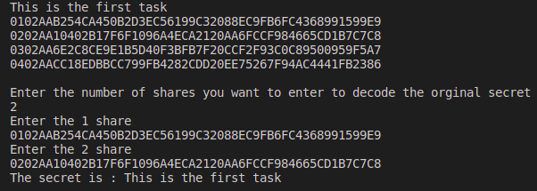
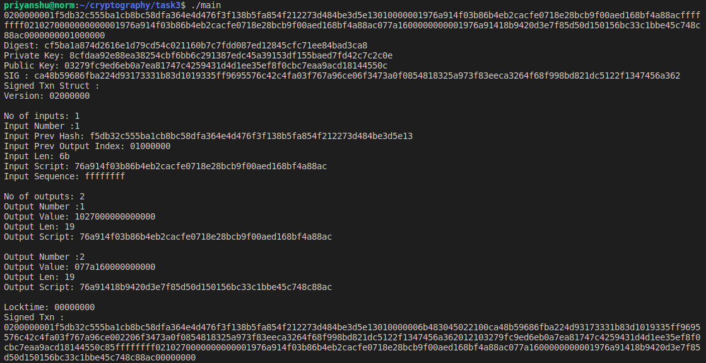

## Cyptography

## Task 0

* To implement ``Shamir Secret Sharing Alogithm`` using C.

Output

## Task 1

* To understand how ``make`` works and then to calculate a ``BIP39 Seed`` using 24 bip mnemonics.

Output

## Task 2

* To derive ``public key``, ``private key``, ``chain node`` and ``reciever and change address`` for ``Bitcoin Testnet`` using 24 bip mnemonics for derivation path ``m/44'/1'/0`/0/``

Output

## Task 3

* To sign an unsigned ``bitcoin testnet`` transaction

Output

## Resources

* [https://github.com/bitcoin/bips/blob/master/bip-0039.mediawiki](https://github.com/bitcoin/bips/blob/master/bip-0039.mediawiki)
* [https://github.com/bitcoin/bips/blob/master/bip-0032.mediawiki](https://github.com/bitcoin/bips/blob/master/bip-0032.mediawiki)
* [https://github.com/bitcoin/bips/blob/master/bip-0044.mediawiki](https://github.com/bitcoin/bips/blob/master/bip-0044.mediawiki)
