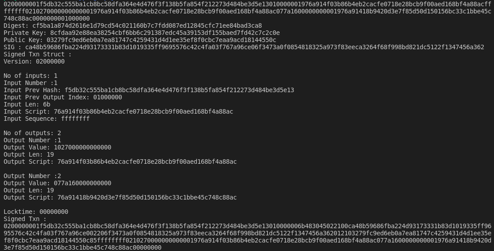

## Cyptography

## Task 0

* To implement ``Shamir Secret Sharing Alogithm`` using C.

Output

## Task 1

* To understand how ``make`` works and then to calculate a ``BIP39 Seed`` using 24 bip mnemonics.

Output

## Task 2

* To derive ``public key``, ``private key``, ``chain node`` and ``reciever and change address`` for ``Bitcoin Testnet`` using 24 bip mnemonics for derivation path ``m/44'/1'/0`/0/``

Output

## Task 3

* To sign an unsigned ``bitcoin testnet`` transaction

Output

## Task 4

* To sign a raw ``Ethereum (Ropsten)`` transaction

Output

## Resources

* [https://iancoleman.io/bip39](https://iancoleman.io/bip39)
* [http://bip32.org](http://bip32.org)
* [https://github.com/bitcoin/bips/blob/master/bip-0039.mediawiki](https://github.com/bitcoin/bips/blob/master/bip-0039.mediawiki)
* [https://github.com/bitcoin/bips/blob/master/bip-0032.mediawiki](https://github.com/bitcoin/bips/blob/master/bip-0032.mediawiki)
* [https://github.com/bitcoin/bips/blob/master/bip-0044.mediawiki](https://github.com/bitcoin/bips/blob/master/bip-0044.mediawiki)
* [https://learnmeabitcoin.com/technical/derivation-paths#bip-44-m440000](https://learnmeabitcoin.com/technical/derivation-paths#bip-44-m440000)
* [https://galactictalk.org/d/549-secret-key-seed-from-bip39/38](https://galactictalk.org/d/549-secret-key-seed-from-bip39/38)
* [https://lsongnotes.wordpress.com/2018/01/14/signing-an-ethereum-transaction-the-hard-way/](https://lsongnotes.wordpress.com/2018/01/14/signing-an-ethereum-transaction-the-hard-way/)
* [https://medium.com/swlh/understanding-data-payloads-in-ethereum-transactions-354dbe995371](https://medium.com/swlh/understanding-data-payloads-in-ethereum-transactions-354dbe995371)
* [https://lsongnotes.wordpress.com/2017/12/21/ethereum-transaction-structure/](https://lsongnotes.wordpress.com/2017/12/21/ethereum-transaction-structure/)
* [https://eth.wiki/en/fundamentals/rlp](https://eth.wiki/en/fundamentals/rlp)
* [https://github.com/ethereum/EIPs/blob/master/EIPS/eip-155.md](https://github.com/ethereum/EIPs/blob/master/EIPS/eip-155.md)
* [https://www.oreilly.com/library/view/mastering-bitcoin/9781491902639/ch04.html](https://www.oreilly.com/library/view/mastering-bitcoin/9781491902639/ch04.html)
* [https://www.mobilefish.com/services/cryptocurrency/cryptocurrency.html](https://www.mobilefish.com/services/cryptocurrency/cryptocurrency.html)
* [https://ethereum.stackexchange.com/questions/3386/create-and-sign-offline-raw-transactions/3392](https://ethereum.stackexchange.com/questions/3386/create-and-sign-offline-raw-transactions/3392)
* [https://hackernoon.com/how-to-generate-ethereum-addresses-technical-address-generation-explanation-25r3zqo](https://hackernoon.com/how-to-generate-ethereum-addresses-technical-address-generation-explanation-25r3zqo)
* [https://www.cs.utexas.edu/users/moore/acl2/manuals/current/manual/index-seo.php/BITCOIN____BIP32-PATH](https://www.cs.utexas.edu/users/moore/acl2/manuals/current/manual/index-seo.php/BITCOIN____BIP32-PATH)
* [https://medium.com/coinmonks/mnemonic-generation-bip39-simply-explained-e9ac18db9477](https://medium.com/coinmonks/mnemonic-generation-bip39-simply-explained-e9ac18db9477)